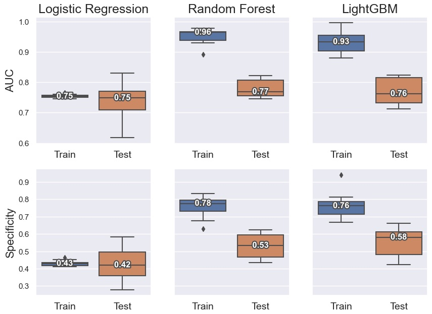
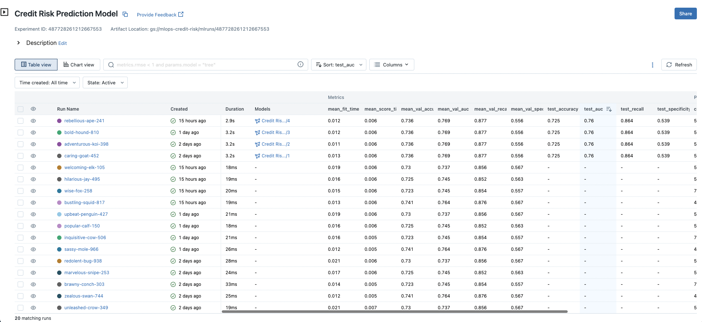
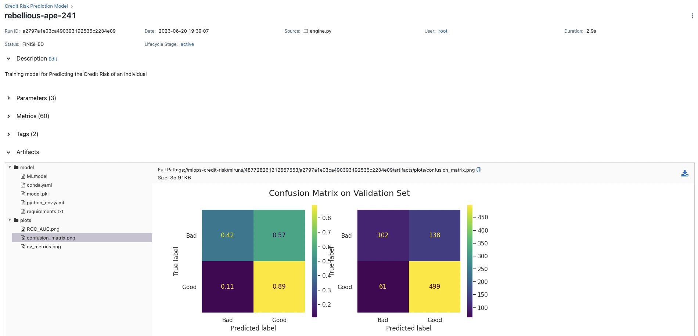
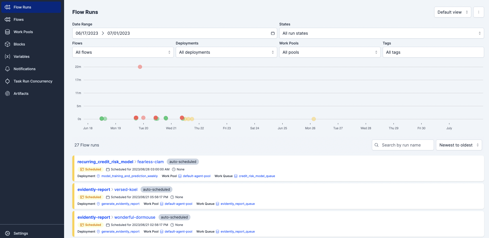
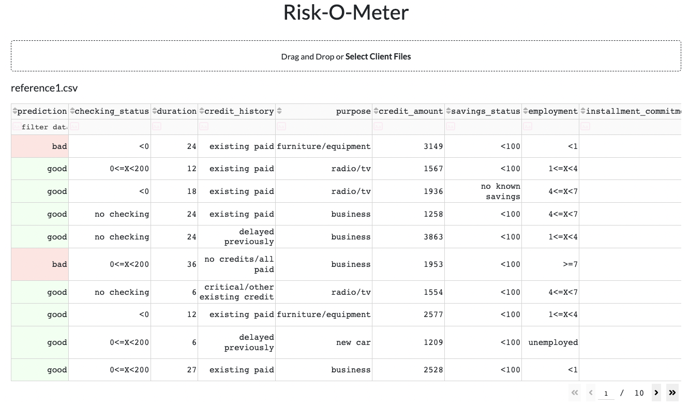
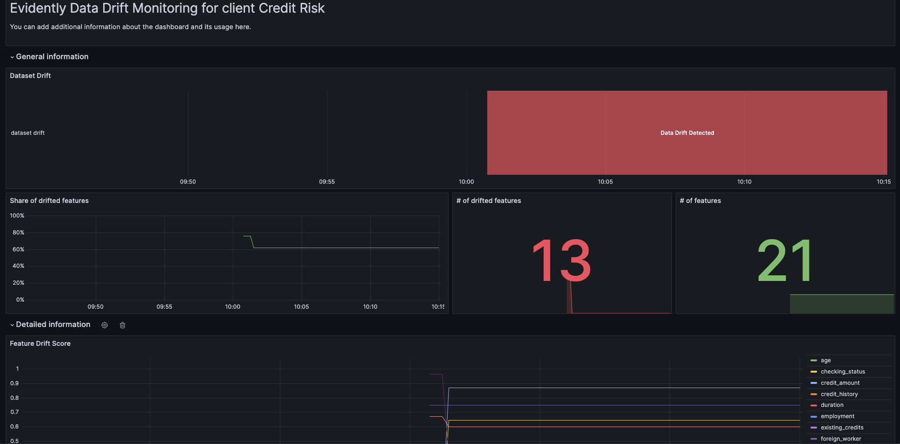
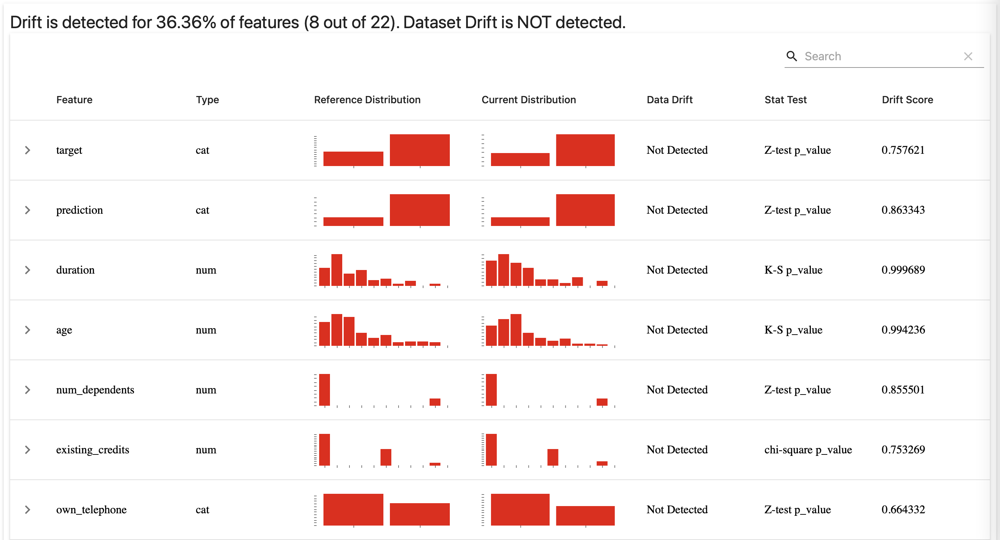

# Updated 
# Updated # MLOps Project - Credit Risk Prediction
# Updated 
# Updated The purpose of this project is to build out a simple classification model to predict the credit risk of bank customers. The resulting model will then be deployed to production using MLOps best practices.
# Updated 
# Updated The dataset can be downloaded from Kaggle via [this](https://www.kaggle.com/btolar1/weka-german-credit) link.
# Updated 
# Updated The dataset contains 1000 entries with 20 categorial/symbolic attributes. Each entry represents a person who takes a credit from a bank where the person is classified as having good or bad (`class`) credit risk according to a set of attributes.
# Updated 
# Updated The advantage with using such a small dataset is that we get to experiment faster, using fewer resources and that we get to address other problems we often don't face when working on larger datasets. Additionally, many companies - in particular startups - have limited datasets to work with in the first place. This would better simulate a situation like that. 
# Updated 
# Updated 
# Updated 
# Updated ## Technologies
# Updated 
# Updated 
# Updated - Cloud: GCP
# Updated - Experiment Tracking: MLFlow
# Updated - Workflow Orchestration: Prefect
# Updated - Containerisation: Docker and Docker Compose
# Updated - Model Deployment: Flask, Docker, Dash, MLFlow
# Updated - Monitoring: Evidently, Grafana, Prometheus, MongoDB
# Updated - Best Practices: Unit and Integration Tests, Makefile
# Updated - (CI/CD: GitHub Actions)
# Updated 
# Updated 
# Updated ## Implementation plan
# Updated 
# Updated - [x] Build notebook with initial model development
# Updated     - [x] Data Preparation
# Updated     - [x] Exploratory Data Analysis
# Updated     - [x] Model Pipeline for Tuning and Training
# Updated     - [x] Evaluate and Analyse Model Performance
# Updated - [x] Experiment Tracking
# Updated - [x] Workflow Orchestration
# Updated - [x] Web Service to Expose the Model Predictions
# Updated - [x] Model Monitoring
# Updated - [x] Tests (partially)
# Updated     - [x] Unit Tests
# Updated     - [x] Integration Tests
# Updated - [] CI/CD and [x] Makefile
# Updated - [x] GCP Cloud Deployment (partially)
# Updated - [x] Use Docker containers for each service
# Updated 
# Updated 
# Updated ## Future Work
# Updated 
# Updated Each one of the implemented steps above can be further developed and improved on. However, some good practices have not been implemented at all and should be considered for more mature projects. These include:
# Updated 
# Updated - Complete deployment on the cloud. Currently everything is deployed in separate Docker containers. These can fairly easily be moved to the cloud as are.
# Updated - Host the generated Evidently reports for easier inspection. 
# Updated - Adding CI/CD
# Updated - Adding IaC
# Updated 
# Updated 
# Updated 
# Updated <br>
# Updated 
# Updated # Project Overview
# Updated 
# Updated Start all services by executing 
# Updated 
# Updated ```bash
# Updated docker compose -f docker-compose.yml up --build
# Updated ``` 
# Updated 
# Updated This will create a separate Docker container for each service. 
# Updated 
# Updated In order to add model training and Evidently report generation Flows to the queue, run the following commands: 
# Updated 
# Updated ```bash
# Updated make model-train-flow
# Updated ``` 
# Updated 
# Updated and 
# Updated 
# Updated ```bash
# Updated make evidently-report-flow
# Updated ``` 
# Updated 
# Updated At this stage, you can access the different services via the following urls:
# Updated 
# Updated - MLFlow: http://localhost:5051/
# Updated - Prefect UI: http://localhost:4200/
# Updated - Model UI, aka **Risk-O-Meter** (allows you to send data to the model and receive predictions. It's a simple simulation of how a bank clerk might use such a system): http://localhost:9696/
# Updated - Prometheus: http://localhost:9091/ 
# Updated - Grafana Dashboard: http://localhost:3000/ (default user/password: admin/admin)
# Updated 
# Updated 
# Updated <br>
# Updated 
# Updated 
# Updated ## Model Development
# Updated 
# Updated The model was developed in a Jupter Notebook ([Model-development.ipynb](model_development/Model-development.ipynb)), and includes data cleaning, data visualisation, basic feature selection, model tuning and model evaluation using 10-fold cross-validation. 
# Updated 
# Updated Three different algorithms are evaluated, Logistic Regression, Random Forest and LightGBM. LightGB was chosen due to its higher specificty and comparable other metrics. It was also significantly faster to train and resulted in a lighter model compared to the second best model. 
# Updated 
# Updated Below are 10-fold cross-validated results for each of the evaluated models. 
# Updated 
# Updated 
# Updated 
# Updated 
# Updated <br><br>
# Updated 
# Updated ## MLFlow Model Registry
# Updated 
# Updated MLFlow is used to register model training runs. Artifacts, which includes models, plots and statistics, are stored in a Google Cloud Bucket, while the server is run in a local Docker container and accessible via the url specified above. 
# Updated 
# Updated After each model training, tuning and cross-validation run, the 5 best models are logged with their corresponding accuracy, AUC, recall and specificity on both the validation and test sets. To speed things up, currently also only 5 different parameter combinations are evaluated, but this can easily be adjusted.
# Updated 
# Updated 
# Updated 
# Updated The single best model is then registred in the Model Registry and it's up to a human evaluator the decide whether to move it into production stage or not. 
# Updated 
# Updated <br>
# Updated 
# Updated 
# Updated 
# Updated 
# Updated <br>
# Updated 
# Updated ## Prefect Workflow Orchestration
# Updated 
# Updated Prefect is used to orchestrate the runs, or DAGs. The model is currently set to automatically retrain every Sunday night to mitigate model degradation. Evidently reports are subsequently generated every 3 hours and stored in a Google Cloud Bucket where they can be downloaded and inspected.
# Updated 
# Updated 
# Updated 
# Updated 
# Updated The model training and report generation flows are deployed in different Docker containers.
# Updated 
# Updated <br>
# Updated 
# Updated ## Model Service UI
# Updated 
# Updated In order to create a simple simulation of how a bank clerk might use a decision system like this, there's also a UI. The **Risk-O-Meter**, as it's called, allows the user to upload a .csv file with data about a list of clients and receive a prediction about their credit risk. 
# Updated 
# Updated - <span style="color:green">Green</span> credit risk means that the risk is lower for the bank and that they should make an offer to the client.
# Updated - <span style="color:red">Red</span> means that the risk is currently a little too high.
# Updated 
# Updated The model's confidence in its prediction for each client is also displayed for the clerk to better asses the prediction.
# Updated 
# Updated The Production stage model is automatically fetched in the Risk-O-Meter. 
# Updated 
# Updated 
# Updated <br>
# Updated 
# Updated 
# Updated 
# Updated 
# Updated ## Monitoring
# Updated 
# Updated - Grafana is used to monitor data drift and Prometheus stores these metrics.
# Updated - Evidently is used to calculate data drift and for more advanced monitoring analysis. The reports are stored in html format in a Google Cloud Bucket and locally in MongoDB in json format. 
# Updated 
# Updated 
# Updated 
# Updated 
# Updated <br>
# Updated 
# Updated [Evidently Report example](monitoring/reports/evidently_report.html)
# Updated 
# Updated The html version is easier to visually inspect, while the metrics in json format can be very useful for creating custom visualisations and statistic if needed. 
# Updated 
# Updated 
# Updated 
# Updated 
# Updated <br>
# Updated 
# Updated 
# Updated ## Tests with Pytest
# Updated 
# Updated Some basic unit and integration tests are also available. These mainly check that the trained model returns predictions that are by and large accurate. However, this allows us to be fairly confident in that the entire data pre-processing pipeline and model training steps are working as expected, we are using correct package versions etc. 
# Updated 
# Updated Since only AUC is taken into account during the tests, they shouldn't be used to decide whether a model is ready for production or not.
# Updated 
# Updated Run the tests by initiating them in the VSCode UI, or by executing the following script:
# Updated 
# Updated ```bash
# Updated python -m pytest model_orchestration_and_tracking/tests/*
# Updated ```
# Updated 

<!-- Last Updated: 2025-12-27 -->
